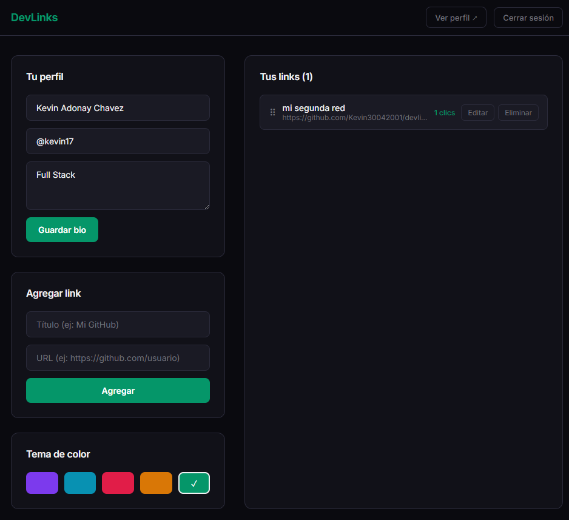

# DevLinks

Personal link aggregator with real-time updates, drag & drop reordering, and public profiles.



## Demo

[devlinks-one-tan.vercel.app](https://devlinks-one-tan.vercel.app)

## Features

- Authentication with email/password and Google
- Add, edit, and delete links
- Drag & drop to reorder links
- Real-time click counter per link
- Public profile page at `/:username`
- Color theme selector (5 themes)
- Bio editing
- Responsive design

## Stack

**Frontend:** React, React Router, @dnd-kit  
**Backend:** Firebase (Auth + Firestore)  
**Deploy:** Vercel

## Local Setup

### Prerequisites
- Node.js 18+
- Firebase project with Auth and Firestore enabled

### Steps

```bash
git clone https://github.com/Kevin30042001/devlinks.git
cd devlinks
npm install
```

Create a `.env` file based on `.env.example`:

```env
VITE_FIREBASE_API_KEY=
VITE_FIREBASE_AUTH_DOMAIN=
VITE_FIREBASE_PROJECT_ID=
VITE_FIREBASE_STORAGE_BUCKET=
VITE_FIREBASE_MESSAGING_SENDER_ID=
VITE_FIREBASE_APP_ID=
```

```bash
npm run dev
```

### Firestore Rules
rules_version = '2';
service cloud.firestore {
match /databases/{database}/documents {
match /users/{userId} {
allow read: if true;
allow write: if request.auth != null && request.auth.uid == userId;
match /links/{linkId} {
allow read: if true;
allow write: if request.auth != null && request.auth.uid == userId;
}
}
match /usernames/{username} {
allow read: if true;
allow write: if request.auth != null;
}
}
}

## Author

**Kevin Adonay Chavez** — [@Kevin30042001](https://github.com/Kevin30042001)
